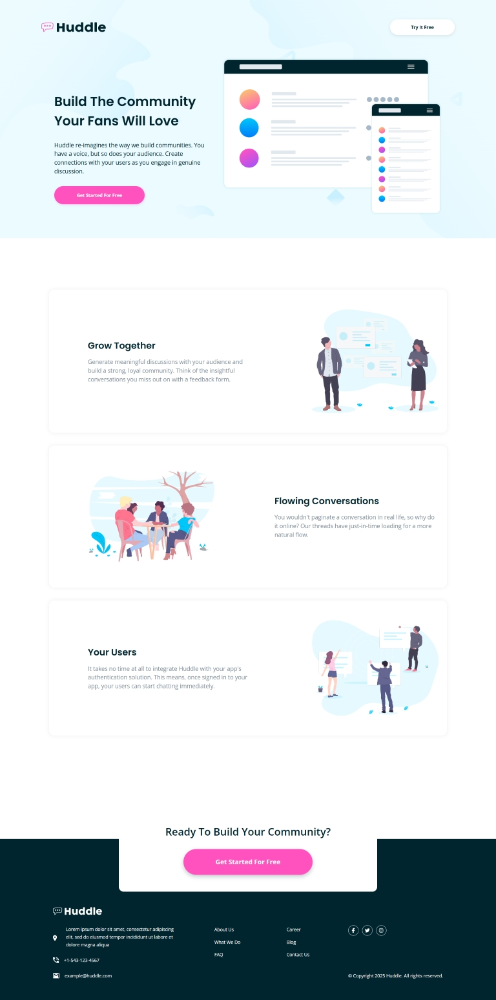

# Frontend Mentor - Huddle landing page with alternating feature blocks solution

This is a solution to the [Huddle landing page with alternating feature blocks challenge on Frontend Mentor](https://www.frontendmentor.io/challenges/huddle-landing-page-with-alternating-feature-blocks-5ca5f5981e82137ec91a5100). Frontend Mentor challenges help you improve your coding skills by building realistic projects.

## Table of contents

- [Overview](#overview)
  - [The challenge](#the-challenge)
  - [Screenshot](#screenshot)
  - [Links](#links)
- [My process](#my-process)
  - [Built with](#built-with)
  - [What I learned](#what-i-learned)
  - [Continued development](#continued-development)
- [Author](#author)

## Overview

### The challenge

Users should be able to:

- View the optimal layout for the site depending on their device's screen size
- See hover states for all interactive elements on the page

### Screenshot

### Links

- Solution URL: [Solution](https://github.com/socratesioa/huddle-landing-page-alternating-feature-blocks)
- Live Site URL: [Live Site](https://socratesioa.github.io/huddle-landing-page-alternating-feature-blocks)

## My process

### Built with

- Semantic HTML5 markup
- CSS custom properties
- Flexbox
- CSS Grid
- Mobile-first workflow

### What I learned

This was a pretty straight forward challenge requiring HTML and CSS. Utilised grid and flexbox to deal with a few layout challenges. Mobile first approach really helped. The figma design file was a bit strange for this challenge but I guess this is part of the game.

### Continued development

I need to be more efficient with writing my code.

## Author

- Website - [My Portfolio](https://portfolio.thisissocrates.com/)
- Frontend Mentor - [@socratesioa](https://www.frontendmentor.io/profile/socratesioa)
